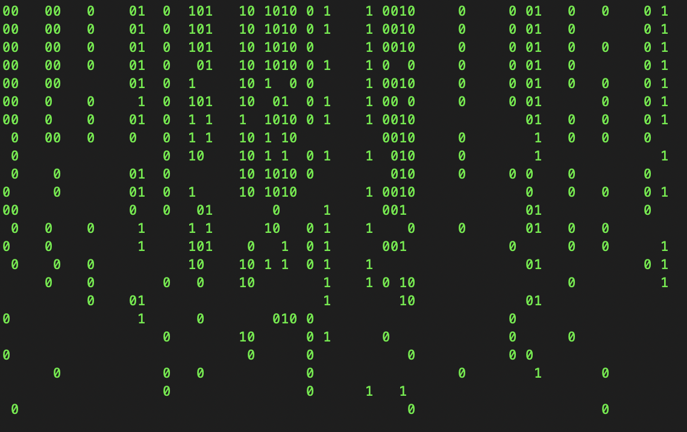

# Python Matrix Animation

A python3 program that print (Matrix) like animation (0,1)

## Setup:

First You have to clone the repo with the following command
```bash
git clone git@github.com:shk-sufiyan/python-matrix-animation.git
```
Then change the directory and run the python programe
```bash
python3 app.py
```

## Example:
